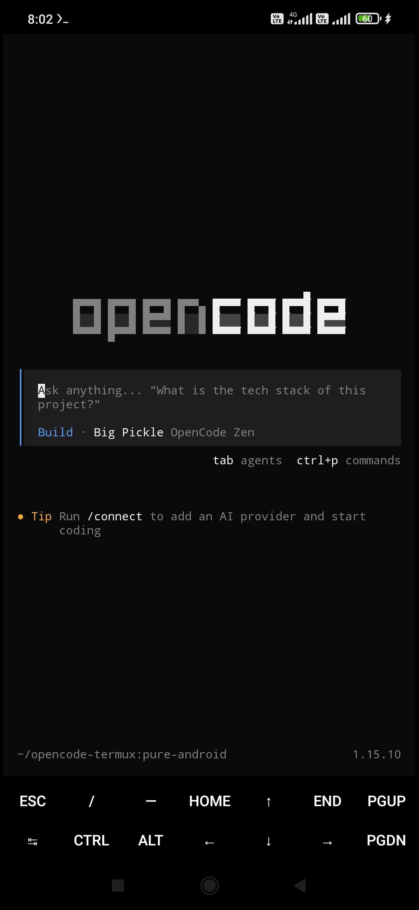

<p align="center">
  <picture>
    <source media="(prefers-color-scheme: dark)" srcset="https://opencode.ai/images/opencode-logo-light.svg">
    
  </picture>
</p>

<h1 align="center">OpenCode CLI — Native Android Install</h1>

<p align="center">
  <strong>Run OpenCode natively on your Android phone via Termux</strong><br>
  <em>No emulators. No PRoot. No Ubuntu chroot. Just pure native performance.</em>
</p>

<p align="center">
  <a href="https://github.com/Radit-lab/opencode-android"></a>
  <a href="https://github.com/Radit-lab/opencode-android/blob/main/LICENSE"></a>
  <a href="https://opencode.ai"></a>
  <a href="https://github.com/Radit-lab/opencode-android"></a>
</p>

<p align="center">
  
  <br>
  <em>OpenCode running natively in Termux on Android — no emulators</em>
</p>

---

## What This Is

[OpenCode](https://opencode.ai) is an AI-powered CLI coding agent. Normally, installing it on Android requires running a full Linux emulator (like PRoot Ubuntu), which is **slow, bloated, and eats gigabytes of storage**.

This guide lets you install OpenCode **natively** on Termux — the same binary, zero emulation overhead, directly on your phone.

---

## Prerequisites

- **Android 8+** (ARM64)
- **Termux** installed from [F-Droid](https://f-droid.org/packages/com.termux/) (not Google Play — it's outdated)
- At least **2 GB free storage**
- A stable internet connection

---

## Quick Install (One Command)

If you trust the script, run this in Termux:

```bash
bash <(curl -fsSL https://raw.githubusercontent.com/Radit-lab/opencode-android/main/install.sh)
```

Or clone and run manually:

```bash
pkg update && pkg upgrade -y
pkg install git -y
git clone https://github.com/Radit-lab/opencode-android.git
cd opencode-android
chmod +x install.sh
./install.sh
```

---

## What the Script Does

| Step | Description |
|------|-------------|
| 1 | Updates Termux packages |
| 2 | Installs build dependencies (git, dpkg, nodejs) |
| 3 | Adds glibc compatibility layer |
| 4 | Clones & compiles the Termux OpenCode wrapper |
| 5 | Installs the `.deb` package globally |
| 6 | Configures SSL certificates for AI API access |
| 7 | Requests storage permissions |
| 8 | Cleans up build artifacts to save space |

---

## Manual Step-by-Step

Prefer to do it yourself? Here's exactly what happens:

### 1. Update & Install Dependencies

```bash
pkg update && pkg upgrade -y
pkg install git dpkg nodejs -y
```

### 2. Install glibc (Standard Linux Libraries)

Android uses bionic libc instead of glibc. We need glibc for binary compatibility.

```bash
pkg install glibc-repo -y
pkg install glibc ca-certificates -y
```

### 3. Compile the Termux Wrapper

```bash
git clone https://github.com/Hope2333/opencode-termux.git
cd opencode-termux
./tools/produce-local.sh latest
./scripts/build.sh
./scripts/package/package_deb.sh
```

### 4. Install the Package

```bash
dpkg -i packaging/dpkg/opencode_0.0.0_aarch64.deb
```

### 5. Fix SSL Certificates

OpenCode needs to find SSL certs to talk to AI APIs. Termux stores them in a custom path.

```bash
echo 'export SSL_CERT_FILE=/data/data/com.termux/files/usr/etc/tls/cert.pem' >> ~/.bashrc
echo 'export SSL_CERT_FILE=/data/data/com.termux/files/usr/etc/tls/cert.pem' >> ~/.profile
source ~/.profile
```

### 6. Grant Storage Access

```bash
termux-setup-storage
```

Accept the permission popup on your screen. Your phone's files will be accessible at `~/storage/`.

### 7. Clean Up

```bash
cd ~
rm -rf ~/opencode-termux
pkg clean
apt autoremove -y
npm cache clean --force
```

---

## Usage

Navigate to any project folder and run:

```bash
cd ~/storage/downloads/my-project
opencode
```

On first launch, you'll need to configure your API key. Follow the prompts to connect to your preferred AI provider.

---

## Troubleshooting

### SSL Errors
```
Error: SSL certificate problem
```
Make sure the env var is set:
```bash
echo $SSL_CERT_FILE
```
It should output `/data/data/com.termux/files/usr/etc/tls/cert.pem`.

### Permission Denied
```
Error: EACCES: permission denied
```
You skipped `termux-setup-storage`. Run it and accept the popup.

### Command Not Found
```
opencode: command not found
```
The `.deb` install failed. Re-run the build steps (Phase 2).

### Out of Space / Random Crashes
Termux can run out of inodes or disk. Run the cleanup:
```bash
pkg clean && apt autoremove -y && npm cache clean --force
```

---

## How It Works

Android uses a custom C library (**bionic**) instead of the standard **glibc** that most Linux binaries expect. The wrapper in [opencode-termux](https://github.com/Hope2333/opencode-termux) uses a **linker shim** (`bun-termux-loader`) that translates between the two, letting the official OpenCode binary run directly on your phone without modification.

No emulation. No virtualization. Just a thin translation layer.

---

## Credits

- [OpenCode](https://opencode.ai) — The AI coding agent that powers this
- [Hope2333/opencode-termux](https://github.com/Hope2333/opencode-termux) — The Termux build system
- **Radit-lab** — Guide and automation scripts

---

## License

This project is licensed under the MIT License — see the [LICENSE](LICENSE) file for details.
